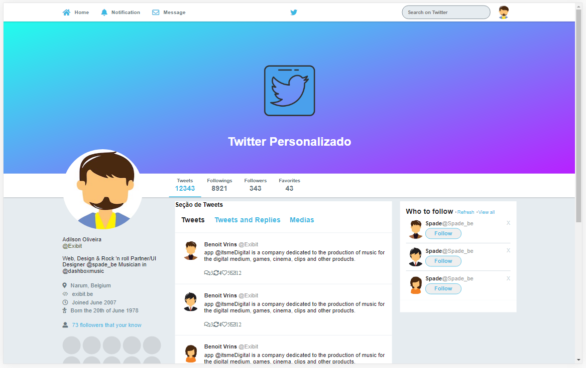
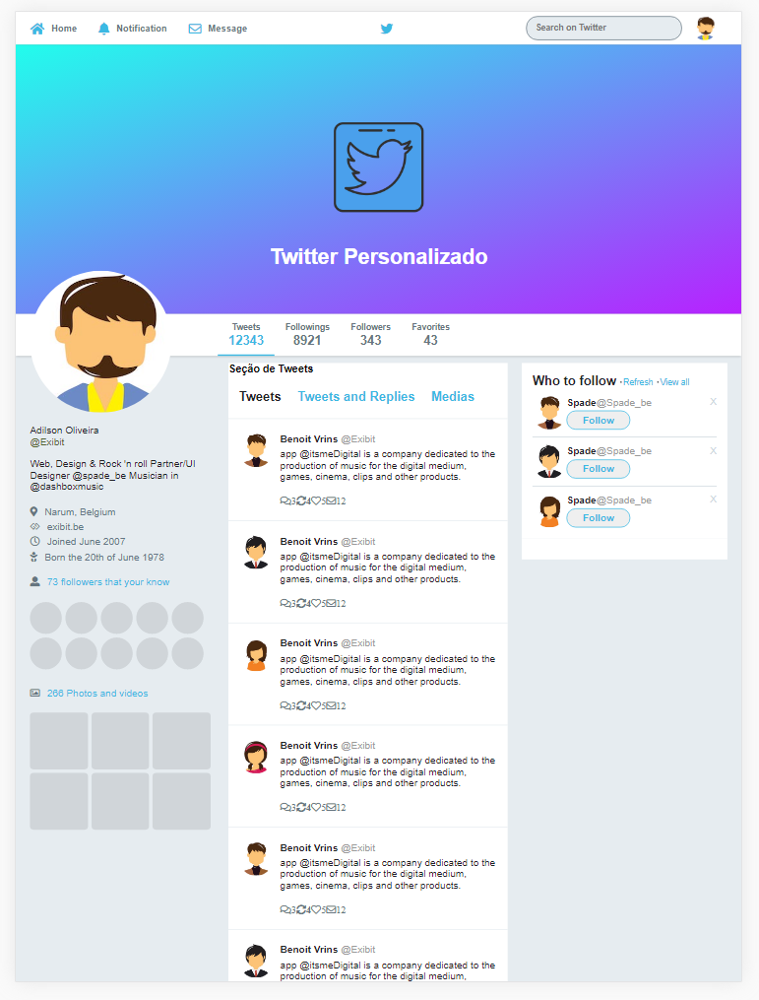
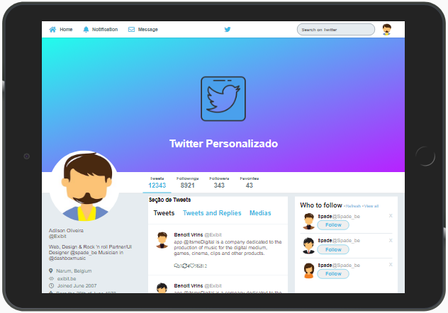
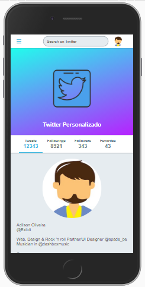
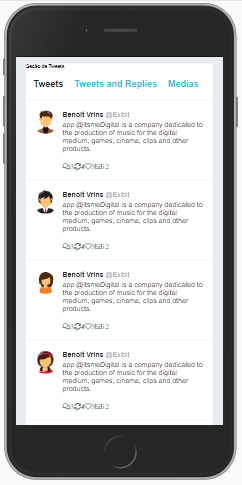

<h1 align="center">
    
</h1>

<h4 align="center"> 
	:heavy_check_mark: 🚀 Layout Responsivo :heavy_check_mark:
</h4>

<p align="center">
  <a href="#-Layout">Layout</a>&nbsp;&nbsp;&nbsp;|&nbsp;&nbsp;&nbsp;
  <a href="#rocket-Technologias">Technologias</a>&nbsp;&nbsp;&nbsp;|&nbsp;&nbsp;&nbsp;
  <a href="#-layout">Algumas Interfaces</a>&nbsp;&nbsp;&nbsp;|&nbsp;&nbsp;&nbsp;	
  <a href="#information_source-como-usar">Como Usar</a>&nbsp;&nbsp;&nbsp;|&nbsp;&nbsp;&nbsp;
</p>

## 💻 Layout

<p>Um pequeno layout de uma página inicial de um clone do Twitter. Feito como exercício e um momento de desenvolver algo por pura diversão, sem nenhuma pressão. Acredito que pode ser uma boa forma de se manter mais ativo e quando estiver sob pressão, gerar os resultados necessários. Só curta, nem tudo tem que ser visto como um trabalho penoso, tudo flúi melhor quando estamos fazendo coisas das quais gostamos de fazer. 
</p>

## 🔖 Algumas Interfaces 
<p align="center"> 
  
</p>
<p align="center"> 
  
</p>
<p align="center"> 
  
</p>
<p align="center"> 
  
   
 </p>


## :rocket: Tecnologias

Esse projeto foi desenvolvido com as seguintes tecnologias:

- [HTML5](https://www.w3schools.com/html/default.asp)
- [CSS3](https://www.w3schools.com/css/default.asp)

## :information_source: Como Usar


Para clonar essa aplicação, você precisará de [Git](https://git-scm.com), instalado em seu computador.

Na sua linha de comando

### Install API
```bash
# Clone this repository
$ git clone https://github.com/ApoOliveira18/layout-responsivo-cloneTwitter.git
# Go into the repository
$ cd layout-responsivo-cloneTwitter/
```
---

Feito com ♥ && 🎧 && 😊 || 😥 
 por Adilson Oliveira :wave: [Get in touch!] www.linkedin.com/in/adilson-p-oliveira

[HTML5]: https://www.w3schools.com/html/default.asp
[CSS3]: https://www.w3schools.com/css/default.asp
